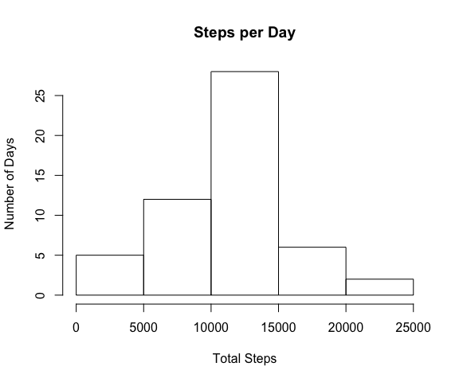
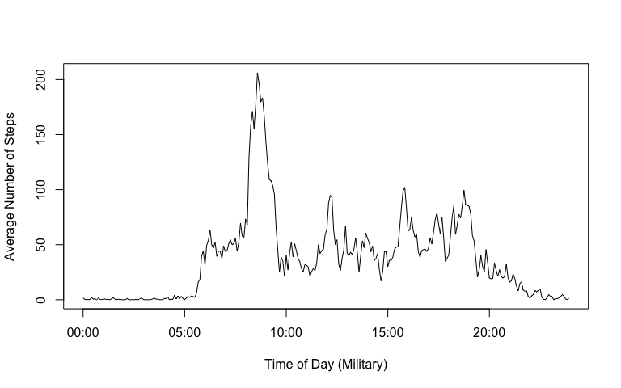
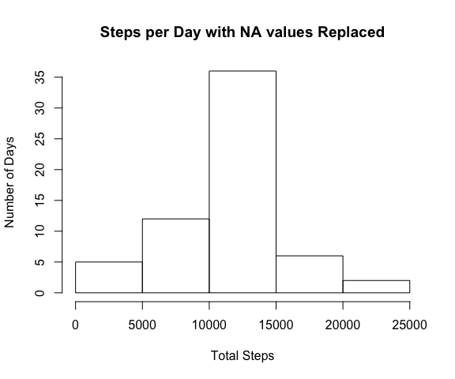
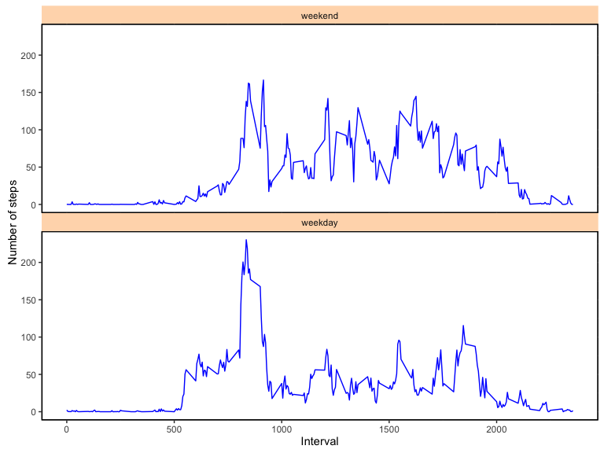

# Reproducible Research: Peer Assessment 1


## Loading and preprocessing the data

```r
suppressWarnings(library(plyr))
suppressWarnings(library(ggplot2))
data <- read.csv("activity.csv")

# For graphing clarity, change interval to posix
data$intervalTime <- as.POSIXct(((floor(data$interval / 100) * 60) + (data$interval %% 100)), origin=as.POSIXct(paste(Sys.Date(), "00:00:00")))
```

## What is mean total number of steps taken per day?


```r
# Calculate the total number of steps taken per day
agg <- aggregate(data$steps, list(data$date), sum)
```

```r
# Make a histogram of the total number of steps taken each day
hist(agg$x, xlab="Total Steps", ylab="Number of Days", main="Steps per Day")
```

<!-- -->

```r
# Calculate and report the mean and median of the total number of steps taken per day
# It looks better if the mean and median are reported together -
#   so save here and print below with no code in between
m <- paste("Mean: ", mean(agg$x, na.rm=TRUE))
med <- paste("Median: ", median(agg$x, na.rm=TRUE))
```

```
## Mean:  10766.1886792453
```

```
## Median:  10765
```

## What is the average daily activity pattern?

```r
# Make a time series plot (i.e. type = "l") of the 5-minute interval (x-axis) and the average number of steps taken, averaged across all days (y-axis)
agg_time <- aggregate(data$steps, list(data$intervalTime), FUN=mean, na.rm=TRUE) 
plot(agg_time$Group.1, agg_time$x, ylab="Average Number of Steps", xlab = "Time of Day (Military)", type="l", xaxs="r")
```

<!-- -->

```r
# Which 5-minute interval, on average across all the days in the dataset, contains the maximum number of steps?
aggInterval <- aggregate(data$steps, list(data$interval), FUN=mean, na.rm=TRUE) 
cat("Interval with Maximum Average Steps: ", aggInterval[aggInterval$x == max(aggInterval$x), "Group.1"])
```

```
## Interval with Maximum Average Steps:  835
```


## Imputing missing values

```r
#    Calculate and report the total number of missing values in the dataset (i.e. the total number of rows with NAs)
cat("Number of Intervals with Missing Step Count: ", sum(is.na(data$steps)))
```

```
## Number of Intervals with Missing Step Count:  2304
```


```r
#    Devise a strategy for filling in all of the missing values in the dataset. The strategy does not need to be sophisticated. For example, you could use the mean/median for that day, or the mean for that 5-minute interval, etc.

#    Create a new dataset that is equal to the original dataset but with the missing data filled in.

# Replace the NA values with the mean value for that interval from all of the other days.  This implies that the overall mean will not change
filledDS <- adply(data, 1, function(y) {if(is.na(y$steps)) y$steps <- aggInterval[aggInterval$Group.1 == y$interval,"x"]; y})
```


```r
#    Make a histogram of the total number of steps taken each day and Calculate and report the mean and median total number of steps taken per day. Do these values differ from the estimates from the first part of the assignment? What is the impact of imputing missing data on the estimates of the total daily number of steps?

# Calculate the total number of steps taken per day
aggFilled <- aggregate(filledDS$steps, list(filledDS$date), sum)

hist(aggFilled$x, xlab="Total Steps", ylab="Number of Days", main="Steps per Day with NA values Replaced")
```

<!-- -->


```r
# Calculate and report the mean and median of the total number of steps taken per day
# It looks better if the mean and median are reported together -
#   so save here and print below with no code in between
mFilled <- paste("Mean with NA Values Replaced: ", mean(aggFilled$x))
medFilled <- paste("Median with NA Values Replaced: ", median(aggFilled$x))
diffMean <- paste("Difference from original Mean: ", (mean(aggFilled$x) - mean(agg$x, na.rm=TRUE)))
diffMed <- paste("Difference from original Median: ", (median(aggFilled$x) - median(agg$x, na.rm=TRUE)))
```


```
## Mean with NA Values Replaced:  10766.1886792453
```

```
## Median with NA Values Replaced:  10766.1886792453
```

```
## Difference from original Mean:  0
```

```
## Difference from original Median:  1.1886792452824
```

## Are there differences in activity patterns between weekdays and weekends?

```r
# Create a new factor variable in the dataset with two levels – “weekday” and “weekend” indicating whether a given date is a weekday or weekend day.
filledDS$day <- sapply(as.POSIXct(filledDS$date), function(x) if((weekdays(x) == "Sunday") | (weekdays(x) == "Saturday")) as.factor("weekend") else as.factor("weekday"))
```


```r
# Make a panel plot containing a time series plot (i.e. type = "l") of the 5-minute interval (x-axis) and the average number of steps taken, averaged across all weekday days or weekend days (y-axis). See the README file in the GitHub repository to see an example of what this plot should look like using simulated data.

# Just so we show weekend first
filledDS$day = with(filledDS, factor(day, levels = rev(levels(day))))

# Build the data to graph
aggX <- aggregate(filledDS$steps, list(filledDS$interval, filledDS$day), mean)

# Contruct the base graph
pl <- ggplot(aggX, aes(Group.1, x)) + facet_wrap(~ Group.2, ncol=1) + geom_line(colour="blue") + labs(x = "Interval", y = "Number of steps", color="yellow") 

# Add some various theme elements
pl + theme(panel.background = element_rect(fill = 'white', colour = 'black')) + theme(strip.background = element_rect(fill="peachpuff")) + theme(panel.margin = unit(0, "lines")) + theme(panel.border = element_rect(colour = "black", fill=NA, size=1))
```

<!-- -->
